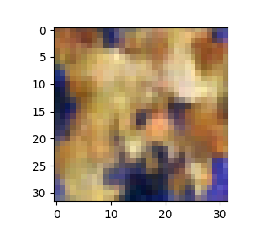

# Diffuser
## vae
variational autoencoder is autoencoder whose encodings distribution is regularised and latent 
space is explictly represented, continuous and structured, allowing for smooth interpolation. 
1) encoder produce mean and log variance (variance is always positive, inconsistant with 
   neutral net output) instead of latent features.
2) re-parameterize uses mean, log variance and N(0,I) sampling as alternative of gaussian 
   distribution sampling, making the process derivable and latent Z be N(0,1) distribution.
3) decoder takes Z and decodes(mlp) to feature vectors of same size as input. With sigmoid,
   normalize to 0~1 for image generation.
4) loss function KL(N(u(Z),var(Z)) || N(0,I)), aims at making the encoder output distribution 
   approaching standard normal distribution.
	```python
	#Why? we need keep the noise of Z. 
	#without noise, latent space lacks variability, and decoder may produce only a limited 
   	#set of outputs and get poor interpolation performance. 
   	
	Z = u + exp(logvar * 0.5) * eps #sampling
	(u,logvar is output of encoder, eps sampled from N(0,I)) 
   	#"exp(logvar*0.5)*eps" noise item tend tobe zero (logvar incline to negative infinity) 
   	#during training, and degrade vae to auto-encoder. thus latent space representations can't 
   	#adequately represent the diversity of the input data.
	```
6) loss function ||X-X*||^2, aims at minimize the difference between input and output.

7) run script
	```python
	python models/common/vae.py
   	#without training, the decoder produces continuous but meanless handwrite figures.
   	#after training, the decoder produces continuous and meanful handwrite figures.
 	```
  


## ddpm/gaussiandiffusion
a unsupervised learning and generative modeling iteratively applying a series of diffusion 
steps to a N(0,I) noise distribution in forward, and starting from a N(0,I) noise sample and 
applying the inverse of the learned transformations and generate final samples in backward.

T: timesteps
b(t): nosie var at timestep t
a(t): 1 - b(t)
e(t): noise N(0,I)

1) forward
	starts from raw image x0, add noise each step and finally get a pure noise.
	each step depends only on last step (markov process).
	distribution q(x(t)|x(t-1)) ~ N(sqrt(1-b(t))*x(t-1), b(t)*I)
	
	```python
	#x(t) is a linear combinaiton of last x(t-1) and noise e(t)

	x(t) = sqrt(a(t))*x(t-1) + sqrt(1-a(t))*e(t)
     	 #       ... markov process ...        #
	 	 = sqrt(a(1)a(2)..a(t))*x0 + sqrt(1-a(1)a(2)..a(t))*e(t)
	
	#at timestep t, the x(t) can be formed from x0 and a noise e directly.
	```
2) backward
	starts from a pure noise, denoise each step and finally get a image.
	q(x(t-1)|x(t)) is unknown, but can use neural network to model the transform distribution.
	```python
	# distribution q(x(t-1)|x(t)) ~ N(u(x(t),t), b((x(t),t)))
	#       ... bayes theorem, gaussian distribution ...        #
	u(x(t),t) = sqrt(a(t))*(1-a(1)a(2)..a(t-1))/(1-a(1)a(2)..a(t))*x(t) + sqrt(a(1)a(2)..a(t-1))/(1-a(1)a(2)..a(t))*b(t)*x(0)
	b(x(t),t) = (1 - a(1)a(2)..a(t-1)) / (1 - a(1)a(2)..a(t)) * b(t)

	# x0 can be estimated by forward calculaiton formula.
	x(0) = sqrt(1 / a(1)a(2)..a(t))*x(t) - sqrt(1 / a(1)a(2)..a(t) - 1)*E(t)

	# Finally, only E(t), the noise added at step t in forward process, is unknown. Predict it by network!
	E(t) = Network(x(t), t)

	# then x(t-1) formed from x(t)
	x(t-1) = u(x(t),t) + sqrt(b((x(t),t)))*e
	```
3) training 
	it's expensive to start from timestep 1 to timestep T, following the forward and backward process.
	the max likelihood can be tranformed at each single timestep
	```python
	L = ||E(t) - e(t)||^2
	# for any single timestep t, minimize the noise e(t) added at forward and E(t) predicted at backward.
	```
	the training steps: 
	1)) with random timestep t, generate random noise e(t) and forward transform input image x(0) to x(t)
	2)) neural network takes x(t) and t, to predict noise E(t)
	3)) minimize the diff between E(t) and e(t)
4) inference
	follow the backward process, starts from N(0,I) noise and restore the x(0), steps:
	1)) iterate from timestep T-1 to 0
	2)) at each timestep t, neural network takes x(t) and t, to predict noise E(t)
	3)) calculate u(x(t),t) and b(x(t),t)
	4)) if t!=0, generate e ~ N(0,I), else e=0
	5)) x(t-1) = u(x(t),t) + sqrt(b(x(t),t)) * e, a sampling process indeed.
	6)) repeat 2-5, until get x(0)
5) improvements
	ddim:
	with trained ddpm, the sampling process can be simplied with fewer steps.
	```python
	# x(t) -> x(t'), t' <= t-1
	x(t') = sqrt(a(1)a(2)..a(t'))*x(0) + sqrt(1-a(1)a(2)..a(t')-sigma*sigma)*E(t)+sigma*e
	x(0) = sqrt(1 / a(1)a(2)..a(t))*x(t) - sqrt(1 / a(1)a(2)..a(t) - 1)*E(t)
	sigma*sigma = eta * sqrt((1-a(1)a(2)..a(t')) / (1-a(1)a(2)..a(t))) * sqrt(1 - (1-a(1)a(2)..a(t))/a(1)a(2)..a(t'))
	e ~ N(0,I)
	```


	predict v: 
	instead of predict the noise, the model is expected to predict v
	```python
	# refers to "Progressive Distillation for Fast Sampling of Diffusion Models"

	# v is formulated as combination of x0 and noise, kinding of use the 
    # model to predict both x0 and noise.
	v = sqrt(a(1)a(2)..at(t))*e(t) - sqrt(1-a(1)a(2)..at(t))*x(0)

	# combining x(t) = sqrt(a(1)a(2)..a(t))*x0 + sqrt(1-a(1)a(2)..a(t))*e(t), predict x(0):
	x(0) = sqrt(a(1)a(2)..a(t))*x(t) - sqrt(1-a(1)a(2)..at(t))*v
	e(t) = (sqrt(1 / (a(1)a(2)..a(t)))*x(t) - x(0)) / sqrt(1/(a(1)a(2)..a(t)) - 1)
	```
6) run scripts
	```python
	python models/ddpm.py
	python models/ddim.py
	# see generated image example: (trained on cifar10)
 	```
 

## stable diffuser


## DiT
