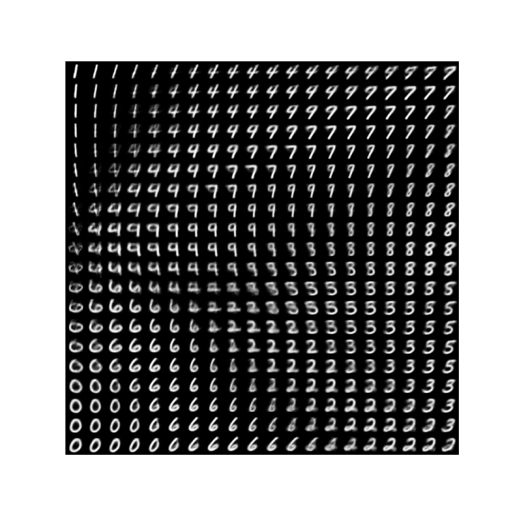

# Diffuser
## vae
variational autoencoder is autoencoder whose encodings distribution is regularised and latent 
space is explictly represented, continuous and structured, allowing for smooth interpolation. 
1) encoder produce mean and log variance (variance is always positive, inconsistant with 
   neutral net output) instead of latent features.
2) re-parameterize uses mean, log variance and N(0,I) sampling as alternative of gaussian 
   distribution sampling, making the process derivable and latent Z be N(0,1) distribution.
3) decoder takes Z and decodes(mlp) to feature vectors of same size as input. With sigmoid,
   normalize to 0~1 for image generation.
4) loss function KL(N(u(Z),var(Z)) || N(0,I)), aims at making the encoder output distribution 
   approaching standard normal distribution.

   	#Why? we need keep the noise of Z 
   	#without noise, latent space lacks variability, and decoder may produce only a limited 
   	#set of outputs and get poor interpolation performance.
   
	Z = u + exp(logvar * 0.5) * eps 
	(u,logvar is output of encoder, eps sampled from N(0,I))
   	#"exp(logvar*0.5)*eps" noise item tend tobe zero (logvar incline to negative infinity) 
   	#during training, and degrade vae to auto-encoder. thus latent space representations can't 
   	#adequately represent the diversity of the input data.

6) loss function ||X-X*||^2, aims at minimize the difference between input and output.

7) run script

	python models/vae/vae.py
   	#without training, the decoder produces continuous but meanless handwrite figures.
   	#after training, the decoder produces continuous and meanful handwrite figures.

 

## ddpm

## stable diffuser
