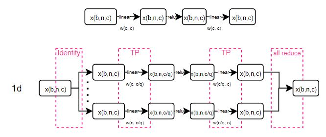
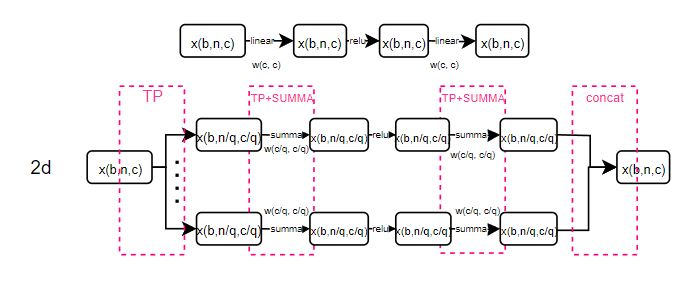
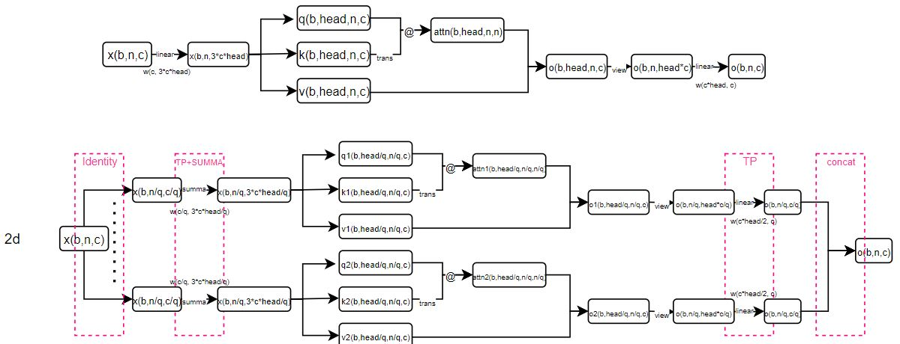

# Brief
Splict model parameter tensors evenly into all devices, and all devices shared one layer parameters. 
For example, if split linear layer into 2 gpus, each gpu holds half of the linear transform matrix, 
and those 2 gpus compute simulateously and integrate the results then. In another word, tensor 
parallel could also be called layer parallel. 

# 1d tensor parallel
For tensor with shape (n, c), split by row to (n/q, c) for each device or split by col to (n, c/q) for 
each device, with q devices required. 

In mlp structure, like "relu(xA)B": 

 
 
In mha structure: 

 

# 2d tensor parallel
For tensor with shape (n, c), split to (n/q, c/q) on each device, with q*q devices required. 

In mlp structure, like "relu(xA)B": 

In mha structure, like self attention multi-head: 

